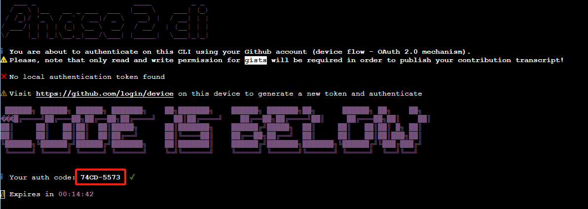
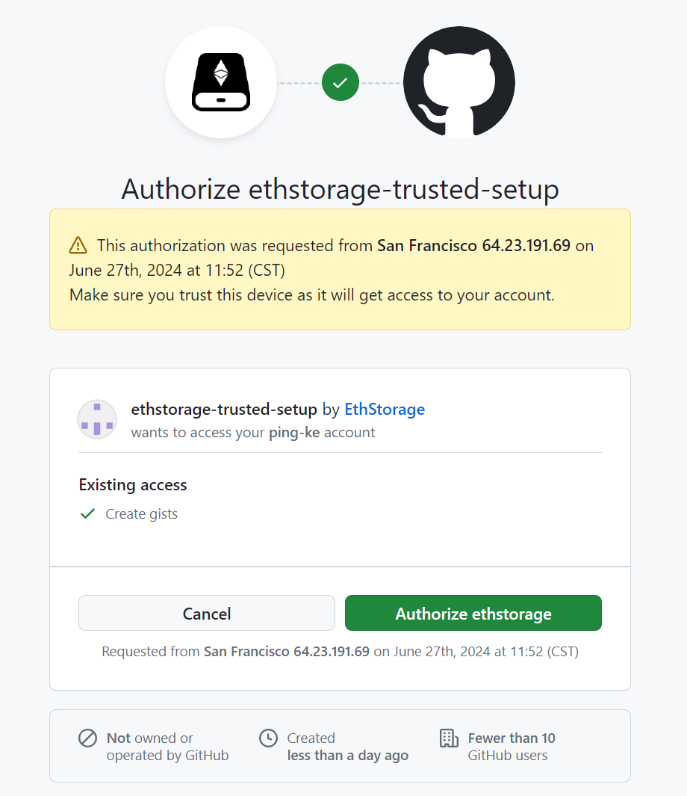
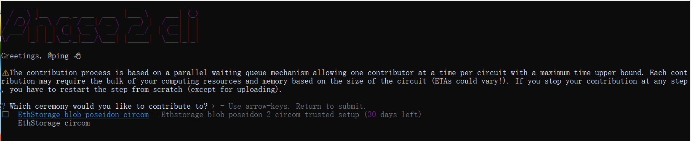
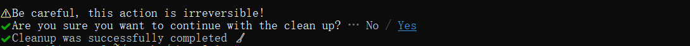
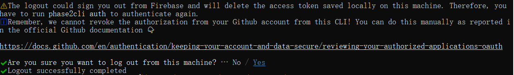

# EthStorage Trusted Setup Ceremony

In essence, a trusted setup ceremony is about creating a number that nobody knows and nobody can figure out. 
Each of us will contribute a portion of the number and then forget what we contributed. Thus, 
no malicious actor can figure out what the number we created is without knowing what each person contributed — 
and all of us (or at least most of us, or at least one of us) forgot what we contributed. 
This prevents anyone from knowing or figuring out the number.

This document will walk you through contributing to the EthStorage trusted setup ceremony. You can reach out to us on Discord.

Contribution will be open till <to be default>

## Background
### What is a Trusted Setup Ceremony?
To generate and verify proofs securely, a cryptographic event must be run where a group of people collaborate to create 
a set of cryptographic parameters needed to kick-off zkSNARKs-based systems. The goal is to ensure that no one can 
influence or manipulate the parameter creation process. The idea is to share the burden of the setup among many 
participants; thus each produces only a fragment of the information needed to generate the ceremony parameter, 
the so-called toxic waste. As the name could suggest, this information must be thrown away by the participants, 
and it only takes at least one of them to successfully forget the toxic waste to ensure the security of the ceremony 
because an attacker needs all fragments in order to break the system; that’s why these events are called MPC Trusted 
Setup Ceremonies.

### How does a Trusted Setup work?
Any Trusted Setup ceremony is organized in two subsequent steps: the Phase 1 is universally reusable in any point of 
contribution as input for any zkSNARKs Phase 2. Briefly, the goal of the Phase 1 is to securely generate zk-SNARK 
parameters for circuits of up to a huge amount of constraints while the Phase 2 is a circuit-specific ceremony that 
must be done for each individual application circuit. Luckily, both phases have a similar workflow. Both assume that 
there is at least one coordinator and multiple participants taking turns in (generally) sequential rounds. The 
coordinator generates and publishes a challenge file, which the first participant downloads, generates some entropy 
(the so-called toxic waste). Then, the participant runs a computation to produce a new challenge file, which is made 
available for coordinator verification. If the contribution has been verified as correct, the next participant will 
repeat the process starting from this latest contribution, otherwise is going to recompute the work taking the 
position of the previous participant. The process is repeated indefinitely until the coordinator decides to end 
the ceremony or a predetermined end date is reached. Ultimately, the ceremony results in the extraction of a key 
for the specific circuit being used.


## Requirements

1. **A computer**: 

A computer with 8GB or above Space and Ram is recommended. Ideally Mac or Linux, Windows via 
[WSL](https://learn.microsoft.com/en-us/windows/wsl/install) is Ok;

2. **A strong internet connection**:

The most common cause of failures is an inability to upload your contribution to the ceremony before the timeout 
period expires. Please run the ceremony with a strong internet connection, and your upload and download bandwidths 
should be at least 25 Mbps each (preferably 50+ Mbps each). Using a wired (ethernet) connection rather than a 
wireless (WiFi) connection is also recommended.

3. **A GitHub Accout**:

A GitHub account must be a month old with at least one follower, five followings and two repos.

4. **Node Version Manager (NVM)**

Running the CLI app to contribute to the ceremony requires node version 16.20 or above.
We’ll install nvm to change node versions by downloading a shell script using the following command in the terminal:
```bash
curl -sL https://raw.githubusercontent.com/nvm-sh/nvm/v0.35.0/install.sh -o install_nvm.sh
sh install_nvm.sh
export NVM_DIR="$HOME/.nvm"
[ -s "$NVM_DIR/nvm.sh" ] && \. "$NVM_DIR/nvm.sh"
```

5. **Install node v18**
   
Before contribution, let’s install and switch to node v18 which the ceremony relies on.
```bash
nvm install 18
nvm use 18
```

## Contributing to the Ceremony

1. **Create a temporary directory**
```bash
mkdir ~/phase2cli
cd ~/phase2cli
```

2. **Install phase2cli**

```bash
npm install @ethstorage-org/phase2cli
```

3. **Authenticate with GitHub**

If your GitHub meets the requirements, you will be eligible for this next step using the following command
```bash
phase2cli auth
```
You will be provided [a link](https://github.com/login/device) and your authentication code as following.



Open the link in your browser and log in your GitHub with your authentication code.



4. **Contribute**

```bash
phase2cli contribute
```

Run the command and select the circom you want to contribute (like _EthStorage circom_);


Once your contribution is complete, you’ll be invited to share a message on Twitter/X — please do so, or on whatever social media platform(s) you prefer!


5. **Cleanup**

After successful contribution you can clear up this file and GitHub authorizations. Use these commands
```bash
phase2cli clean
phase2cli logout
```



## Note
**Make sure your computer does not go to sleep**: When your turn in the queue comes, your computer needs to be awake and connected to the internet. If you’re going to leave your contribution running and step away from the computer, be sure you don’t have your computer set to automatically sleep.


## FAQ
**Error: Unfortunately there was an error with the contribution verification**:

If you meet the following error:
"Unfortunately there was an error with the contribution verification. Please restart phase2cli and try again. If the problem persists, please contact the ceremony coordinator."

**Error: Your contribution took longer than the estimated time**: 

If you meet the following error: 
"Your contribution took longer than the estimated time and you were removed as current contributor. You should wait for a timeout to expire before you can rejoin for contribution."
This means that your contribution uses twice times contributions average used. Recommend using better machines (hardware and network) to provide contribution.

**If you disconnect**: While in the queue, you can re-join by running the npx phase2cli contribute command again.

**Authentication errors**: phase2cli authentication can get rejected if you initially failed the GitHub requirements. Please make sure your GitHub meet the our requirement and reset authentication.

**Cannot rejoin after timeout**: If you encounter problems and your contribution window times out, you won’t be able to rejoin the queue immediately. Rejoin again in a few hours (and talk to us if it still doesn’t work).
